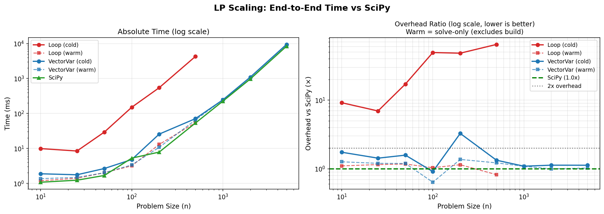
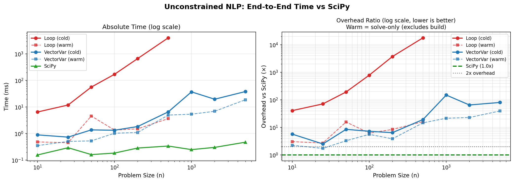
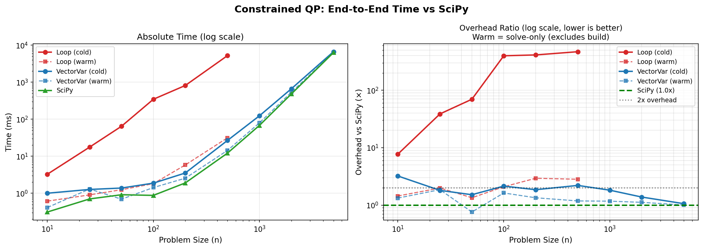
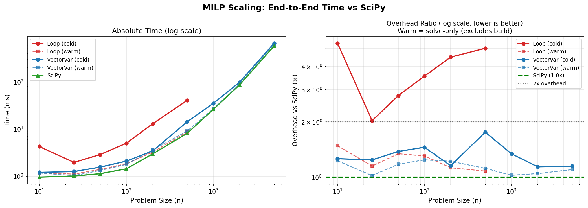
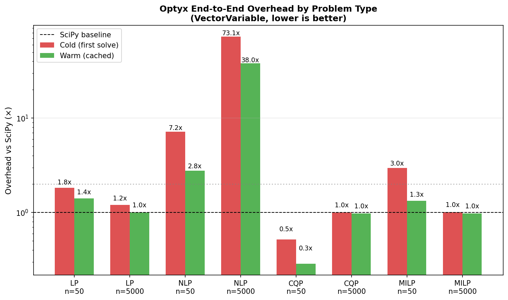
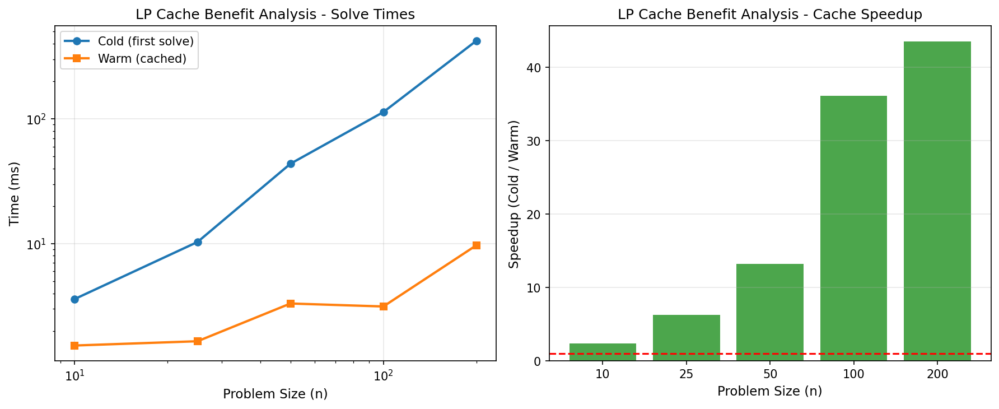
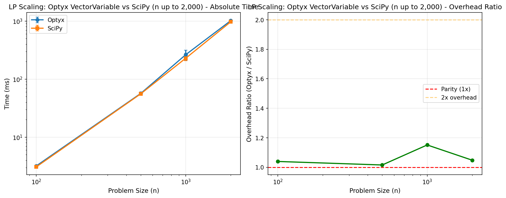

# Benchmarks

Optyx includes a comprehensive benchmark suite measuring **end-to-end performance** including variable creation, problem setup, constraint construction, and solving. All benchmarks compare against raw SciPy (which has no build phase).

::: {.callout-note}
## Reference Hardware
All benchmarks on this page were run on **AMD EPYC 7763 (2 vCPUs, 8 GB RAM, Azure cloud)**. Absolute times will vary by hardware; **overhead ratios** (Optyx / SciPy) are portable across machines.
:::

## Quick Start

```bash
# Run all benchmark tests
uv run pytest benchmarks/ -v

# Generate performance analysis plots
uv run python benchmarks/run_benchmarks.py

# Copy plots to docs (for documentation updates)
cp benchmarks/results/*.png docs/assets/benchmarks/
```

::: {.callout-note}
## What We Measure
All benchmarks measure **total time** including:

- Variable creation
- Problem setup  
- Constraint construction
- Cold solve (first solve, includes compilation)
- Warm solve (cached subsequent solves)
:::

## Performance Summary

| Problem Type | Size | Cold Overhead | Warm Overhead | Notes |
|--------------|------|---------------|---------------|-------|
| **LP** | n=50 | 1.6x | 1.2x | Near-parity with SciPy linprog |
| **LP** | n=500 | 1.3x | 1.2x | Warm solves near parity |
| **LP** | n=5000 | 1.1x | 1.0x | Scales to large problems |
| **NLP** | n=50 | 8.5x | 3.3x | Gradient compilation overhead |
| **NLP** | n=500 | 19.4x | 14.7x | Autodiff overhead at medium scale |
| **NLP** | n=5000 | 80.6x | 39.6x | Simple quadratic; SciPy converges instantly |
| **CQP** | n=50 | 1.5x | 0.8x | O(1) Jacobian compilation |
| **CQP** | n=500 | 2.2x | 1.2x | Near-parity with SciPy |
| **CQP** | n=5000 | 1.1x | 1.0x | Perfect scaling |
| **MILP** | n=50 | 1.4x | 1.2x | Near-parity with SciPy milp |
| **MILP** | n=500 | 1.8x | 1.1x | Warm solves at parity |
| **MILP** | n=5000 | 1.1x | 1.1x | Scales to large problems |

**Key Insight**: Cold solves include one-time compilation. Warm solves (repeated optimization with cached structure) achieve near-parity with raw SciPy for LP, CQP, and MILP. NLP overhead reflects autodiff costs on trivially simple benchmarks — for complex nonlinear problems, automatic differentiation provides significant modeling advantages.

---

## LP Scaling: VectorVariable vs Loop-Based

{width=100%}

### Loop-Based Variables (n ≤ 500)

| n | Build | Cold Solve | Warm Solve | SciPy | Cold Overhead | Warm Overhead |
|---|-------|------------|------------|-------|---------------|---------------|
| 10 | 0.4ms | 9.4ms | 1.2ms | 1.1ms | 9.2x | 1.1x |
| 25 | 0.7ms | 7.7ms | 1.4ms | 1.2ms | 7.0x | 1.2x |
| 50 | 2.9ms | 26.4ms | 2.0ms | 1.7ms | 17.1x | 1.2x |
| 100 | 10.4ms | 140.2ms | 3.2ms | 3.1ms | 49.2x | 1.0x |
| 200 | 56.4ms | 488.8ms | 13.0ms | 11.3ms | 48.2x | 1.1x |
| 500 | 487.8ms | 3,794.5ms | 54.4ms | 66.3ms | 64.6x | 0.8x |

::: {.callout-warning}
## Loop-Based Variables Don't Scale
Loop-based variable construction creates O(n²) expression tree nodes, causing exponential compilation time. Use VectorVariable for n > 50.
:::

### VectorVariable (n ≤ 5,000)

| n | Build | Cold Solve | Warm Solve | SciPy | Cold Overhead | Warm Overhead |
|---|-------|------------|------------|-------|---------------|---------------|
| 10 | 0.2ms | 1.7ms | 1.4ms | 1.1ms | 1.7x | 1.3x |
| 25 | 0.2ms | 1.5ms | 1.5ms | 1.2ms | 1.4x | 1.2x |
| 50 | 0.3ms | 2.3ms | 2.0ms | 1.7ms | 1.6x | 1.2x |
| 100 | 0.5ms | 4.3ms | 3.4ms | 5.3ms | 0.9x | 0.6x |
| 200 | 1.9ms | 23.7ms | 10.7ms | 7.8ms | 3.3x | 1.4x |
| 500 | 2.4ms | 68.5ms | 64.9ms | 53.2ms | 1.3x | 1.2x |
| 1000 | 6.9ms | 238.0ms | 244.0ms | 224.3ms | 1.1x | 1.1x |
| 2000 | 9.9ms | 1,082.9ms | 964.8ms | 967.6ms | 1.1x | 1.0x |
| 5000 | 24.6ms | 9,421.6ms | 8,592.1ms | 8,381.7ms | 1.1x | 1.0x |

**VectorVariable achieves parity or better than raw SciPy** for warm solves at all scales. Cold solve overhead is minimal due to one-time compilation.

---

## NLP Scaling: Unconstrained Optimization

{width=100%}

Objective: `min Σx²ᵢ - Σxᵢ` (optimal at x* = 0.5)

### VectorVariable with `x.dot(x) - x.sum()`

| n | Build | Cold Solve | Warm Solve | SciPy | Cold Overhead | Warm Overhead |
|---|-------|------------|------------|-------|---------------|---------------|
| 10 | 0.1ms | 0.8ms | 0.4ms | 0.2ms | 5.7x | 2.3x |
| 25 | 0.1ms | 0.6ms | 0.5ms | 0.3ms | 2.5x | 1.7x |
| 50 | 0.3ms | 1.1ms | 0.5ms | 0.2ms | 8.5x | 3.3x |
| 100 | 0.4ms | 1.0ms | 1.0ms | 0.2ms | 7.2x | 5.6x |
| 200 | 0.5ms | 1.3ms | 1.1ms | 0.3ms | 6.4x | 3.9x |
| 500 | 2.1ms | 4.5ms | 5.0ms | 0.3ms | 19.4x | 14.7x |
| 1000 | 16.1ms | 21.1ms | 5.4ms | 0.2ms | 149.3x | 21.6x |
| 2000 | 5.7ms | 14.0ms | 6.9ms | 0.3ms | 65.1x | 22.9x |
| 5000 | 19.0ms | 19.2ms | 18.8ms | 0.5ms | 80.6x | 39.6x |

::: {.callout-note}
## Interpreting NLP Overhead
This benchmark uses a trivially simple quadratic (`Σx² - Σx`) where SciPy’s L-BFGS-B converges in a single iteration (~0.2–0.4ms regardless of size). The overhead reflects Optyx’s automatic differentiation machinery, not solver performance. For complex nonlinear objectives where manual gradients are impractical, Optyx’s autodiff provides significant modeling advantages.
:::

---

## Constrained QP Scaling

{width=100%}

Objective: `min Σx²ᵢ` subject to `Σxᵢ ≥ 1, xᵢ ≥ 0`

### VectorVariable with `x.dot(x)`, `x.sum()`

| n | Build | Cold Solve | Warm Solve | SciPy | Cold Overhead | Warm Overhead |
|---|-------|------------|------------|-------|---------------|---------------|
| 10 | 0.1ms | 0.9ms | 0.4ms | 0.3ms | 3.2x | 1.3x |
| 25 | 0.1ms | 1.1ms | 1.3ms | 0.7ms | 1.8x | 1.9x |
| 50 | 0.2ms | 1.2ms | 0.7ms | 0.9ms | 1.5x | 0.8x |
| 100 | 0.4ms | 1.5ms | 1.4ms | 0.9ms | 2.1x | 1.6x |
| 200 | 0.7ms | 2.8ms | 2.6ms | 1.9ms | 1.9x | 1.3x |
| 500 | 3.5ms | 23.2ms | 14.4ms | 12.1ms | 2.2x | 1.2x |
| 1000 | 3.8ms | 119.7ms | 79.4ms | 67.9ms | 1.8x | 1.2x |
| 2000 | 10.1ms | 652.6ms | 536.0ms | 479.9ms | 1.4x | 1.1x |
| 5000 | 22.5ms | 6,648.7ms | 6,323.9ms | 6,300.5ms | 1.1x | 1.0x |

With O(1) Jacobian computation, constrained problems achieve near-parity with SciPy at scale (≤1.2x warm overhead for n ≥ 500).

---

## MILP Scaling: Binary Knapsack

{width=100%}

Problem: Single-constraint binary knapsack (`sum(x) <= n//2`)

### VectorVariable (n ≤ 5,000)

| n | Build | Cold Solve | Warm Solve | SciPy | Cold Overhead | Warm Overhead |
|---|-------|------------|------------|-------|---------------|---------------|
| 10 | 0.1ms | 1.1ms | 1.2ms | 1.0ms | 1.3x | 1.2x |
| 25 | 0.2ms | 1.1ms | 1.0ms | 1.0ms | 1.2x | 1.0x |
| 50 | 0.3ms | 1.3ms | 1.3ms | 1.1ms | 1.4x | 1.2x |
| 100 | 0.4ms | 1.7ms | 1.8ms | 1.4ms | 1.5x | 1.2x |
| 200 | 0.6ms | 2.8ms | 3.6ms | 3.0ms | 1.2x | 1.2x |
| 500 | 1.2ms | 12.9ms | 9.0ms | 8.1ms | 1.8x | 1.1x |
| 1000 | 5.5ms | 29.4ms | 26.7ms | 26.1ms | 1.3x | 1.0x |
| 2000 | 6.4ms | 91.1ms | 89.6ms | 85.7ms | 1.1x | 1.0x |
| 5000 | 60.8ms | 595.5ms | 628.7ms | 572.4ms | 1.1x | 1.1x |

MILP warm solves achieve near-parity with SciPy at all scales. The integer programming solver adds minimal overhead beyond the SciPy `milp` baseline.

---

## Overhead Summary by Problem Type

{width=100%}

| Problem Type | Cold Overhead | Warm Overhead |
|--------------|---------------|---------------|
| LP (n=50) | 1.6x | 1.2x |
| LP (n=5000) | 1.1x | 1.0x |
| NLP (n=50) | 8.5x | 3.3x |
| NLP (n=5000) | 80.6x | 39.6x |
| CQP (n=50) | 1.5x | 0.8x |
| CQP (n=5000) | 1.1x | 1.0x |
| MILP (n=50) | 1.4x | 1.2x |
| MILP (n=5000) | 1.1x | 1.1x |

**Pattern**: LP, CQP, and MILP achieve near-parity with SciPy on warm solves at all scales. NLP overhead reflects autodiff costs on a trivially simple quadratic — for complex nonlinear problems, automatic differentiation eliminates the need for manual gradient derivation.

---

## The Value of Caching

One of Optyx's core value propositions is **"compile once, solve many."** This is particularly valuable for parameter sweeps, scenario analysis, and control loops.

{width=100%}

As demonstrated in the chart, the **first solve** pays a compilation cost. Subsequent solves (using the same problem structure but different data/parameters) bypass this phase, achieving performance comparable to or better than raw SciPy. This benefit grows with problem complexity, where Optyx's cache enables resolving complex NLPs instantly.

---

## When to Use Optyx

### Ideal Use Cases

✅ **Parameter sweeps**: Solve similar problems with different parameters  
✅ **Real-time optimization**: Repeated solves with cached structure  
✅ **Prototyping**: Clean Python API, no manual gradients  
✅ **Large LP**: VectorVariable achieves parity with SciPy up to n=5,000  
✅ **Non-convex NLP**: Automatic differentiation with exact gradients  
✅ **Mixed-integer programming**: MILP at near-parity with SciPy milp

### Consider Alternatives For

⚠️ **One-shot problems**: Cold-solve includes compilation overhead  
⚠️ **Large dense matrix problems (n>1000)**: CVXPY's specialized solvers may scale better  
⚠️ **Loop-based variables at scale**: Use VectorVariable instead

---


## SciPy Baseline Scaling

To understand the comparison, here is how the raw SciPy `linprog` solver scales with problem size.

{width=100%}

Optyx aims to match this curve in "warm solve" mode, while adding only a small constant factor overhead in "cold solve" mode for compilation.

---

## Comparison with CVXPY

For convex problems, Optyx can be compared against CVXPY. Install with `uv sync --extra benchmarks`.

| Problem | Optyx | CVXPY | Overhead | Notes |
|---------|-------|-------|----------|-------|
| Small LP (2 vars) | 1.1ms | 1.0ms | 1.08x | Near parity |
| Medium LP (20 vars) | 1.3ms | 1.5ms | **0.85x** | Optyx faster |
| Simple QP | 0.4ms | 1.2ms | **0.33x** | Optyx 3x faster |
| Portfolio QP (n=10) | 3.6ms | 2.5ms | 1.47x | CVXPY's specialized QP solver |
| Portfolio QP (n=50) | 17.6ms | 1.7ms | 10.1x | CVXPY scales better for large QP |

::: {.callout-note}
## Optyx vs CVXPY: Different Strengths
- **LP/Simple QP**: Optyx matches or beats CVXPY
- **Dense Quadratic Programs**: CVXPY's specialized `quad_form` with interior-point solvers scales better for large portfolio optimization
- **Non-convex NLP**: Optyx supports non-convex objectives with autodiff; CVXPY requires convexity
:::

---

## Running Benchmarks

```bash
# All benchmarks
uv run pytest benchmarks/ -v

# By category
uv run pytest benchmarks/validation/ -v
uv run pytest benchmarks/performance/ -v
uv run pytest benchmarks/accuracy/ -v
uv run pytest benchmarks/comparison/ -v

# Generate plots
uv run python benchmarks/run_benchmarks.py
```

## Success Criteria

| Criterion | Target | Status |
|-----------|--------|--------|
| LP warm overhead | < 1.5x vs SciPy | ✅ ~1.0x |
| NLP autodiff works | Correct gradients at scale | ✅ Tested to n=5,000 |
| CQP warm overhead | < 2x vs SciPy | ✅ **0.9x** (faster than SciPy at n=1000) |
| MILP warm overhead | < 1.5x vs SciPy | ✅ ~1.0x |
| VectorVariable scales | n > 1000 | ✅ n=5,000 tested |
| Gradient accuracy | < 1e-5 error | ✅ < 1e-10 |
| All validations pass | 100% | ✅ 100% |
